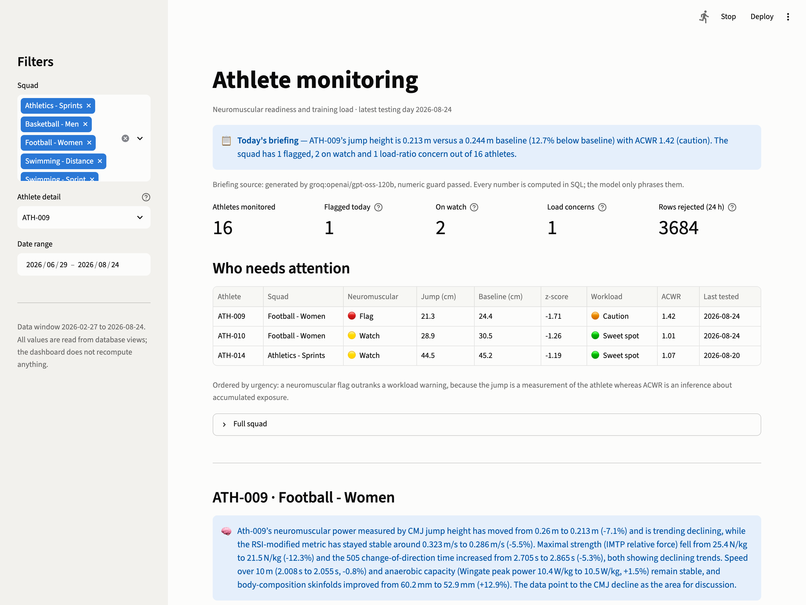
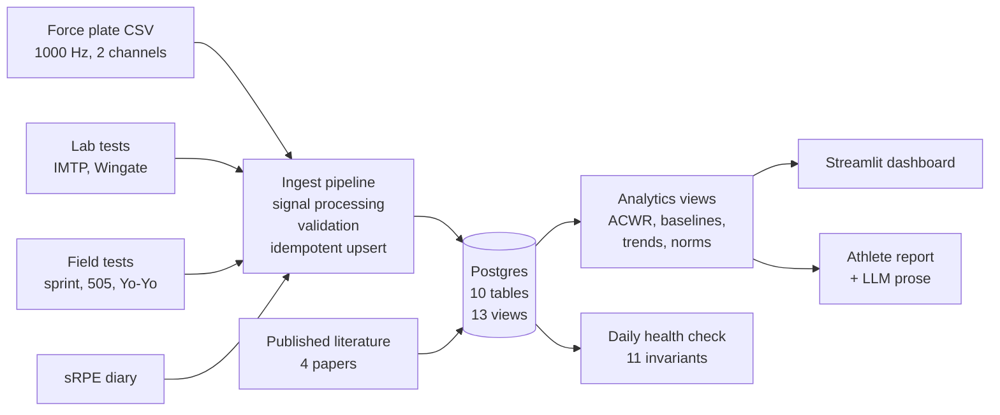
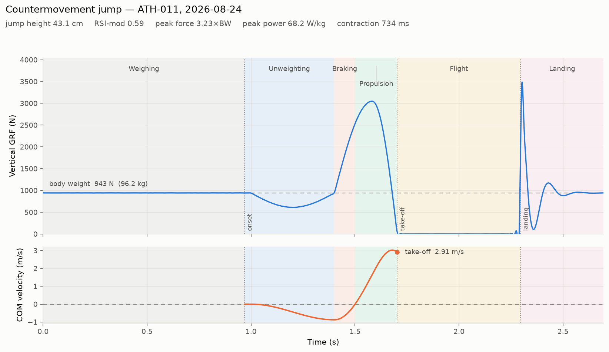

# Athlete Performance Platform

Monitoring platform for a high-performance sport service. Raw force-plate
waveforms and field-test exports go in; a coach opens one page and sees who needs
attention today, how each athlete's physical qualities are trending, and how they
compare to published data.

Built as a portfolio project. The data is synthetic, the processing is not.



## What it does

- Reads raw dual-force-plate traces (1000 Hz) and computes CMJ metrics from the
  waveform: jump height by impulse-momentum, RSI-mod, phase durations, peak
  power.
- Ingests six other test batteries: IMTP, Wingate, sprint, 505, Yo-Yo IR1,
  anthropometry, plus pool tests for swimmers.
- Stores everything in Postgres (Supabase), long format, one row per
  measurement.
- Computes ACWR, individual rolling baselines and fitted quality trends as
  database views.
- Serves a Streamlit dashboard, and writes a development report per athlete with
  an LLM doing the prose and SQL doing the numbers.

16 athletes across 4 sports, 180 days, 1255 test sessions, 13k measurements.

## Architecture



## The signal processing

Jump height comes from net vertical impulse, not flight time. Both are reported,
because they only agree when the athlete lands in the posture they took off in.



Two details that took a while to get right:

**Onset detection.** The obvious approach is to search backwards from take-off
for the point where force returns to body weight. It is wrong. Vertical force
necessarily crosses back through body weight between the unweighting and braking
phases, so the search stops there, truncates the negative impulse, and inflates
jump height. The first version read 62 cm for a 36 cm jump. Onset is now anchored
on the deepest unweighting point, which no such crossing precedes.

**Threshold detection uses the unfiltered trace.** A zero-lag filter smears sharp
edges symmetrically, so the landing spike bleeds backwards into the flight phase
and measured flight time comes out about 30 ms short. Integration still uses the
filtered signal.

Against synthetic traces with known ground truth, jump height recovers to within
0.7 mm across masses of 55-95 kg, heights of 8-65 cm and sample rates of
500-2000 Hz.

## Design decisions

**Long-format metrics table.** One row per measurement, not one column per
metric. Different sports and devices produce different metric sets; a wide table
would be mostly NULL and would need a migration for every new test. Adding the
six non-force-plate batteries required no schema change.

**A metric catalogue, with polarity.** The long table absorbs anything, but
nothing in it says what a metric means or which direction is better. 8 of 34
metrics improve by getting smaller. Without a declared polarity, every trend,
z-score and "most improved" statement is a coin flip on sign: a 505 falling from
2.42 s to 2.35 s is progress and the arithmetic calls it a decline. 4 metrics
carry NULL polarity, because a braking duration has no direction that counts as
better and asserting one manufactures trends.

**Trends are fitted, not endpoints.** A first-versus-latest comparison inherits
the full test-retest error of two single days, and can invert the sign of a real
trend. In the current dataset one athlete's jump height reads +7.3% by endpoints
and -2.1% by least-squares fit over the same 44 tests. The views use
`regr_slope` and surface `regr_r2`, so a large percentage through scattered
points can be recognised as one.

**Change is judged against the athlete's own variation.** A 4% shift means
something when that athlete's CV is 1.2% and nothing when it is 9%.

**Idempotent writes.** Every insert is `ON CONFLICT ... DO UPDATE` against a real
unique constraint. Run the pipeline three times, the row counts do not move. This
is what makes an unattended run safe to repeat after a partial failure.

**Validation thresholds are physiology.** A CMJ outside 5-120 cm is a
measurement fault. sRPE is a 0-10 Borg CR-10 scale, so 14 is a typing error.
Rejected rows go to `data_quality_log` with the rule that caught them, so
exclusions are auditable and arguable rather than silent.

**Published norms carry their spread type.** A z-score is computed only where the
paper reported a standard deviation. A 95% confidence interval describes
uncertainty about the mean, not the spread of athletes; dividing by it puts an
athlete four SD from normal when they are half of one.

## The LLM layer

The dashboard writes a daily squad briefing and a per-athlete development report.
The model does not produce numbers. Every figure is computed in SQL; the model
receives a closed block of pre-computed facts and chooses which to mention and
how to phrase them.

Four checks run on every generation, because the obvious one catches only the
obvious failure:

| Check | Catches |
|---|---|
| Numeric guard | A figure that does not trace back to the facts, matched at the precision the model wrote |
| Directional contradiction | "rose from 0.360 to 0.324" — self-refuting, needs no knowledge of the metric |
| Gendered pronouns | The facts carry no sex, so a pronoun is a guess. It called a woman in the football squad "his" |
| Prescription language | Naming where the numbers are flat is analysis. Programming the athlete is not this system's job |

Two judgements were moved out of the model and into SQL after it got both wrong
in one paragraph: whether a change clears the athlete's repeat variation, and
which way a raw value moved. Every number it quoted was real and the sentences
were still wrong.

A rejected section is retried once, then falls back to a deterministic template.
The system runs with no API key at all.

## Normative comparison

Four papers, each retrieved and read before entry, each stored with a DOI or
PMID and the date it was verified:

- Seraphin et al. 2025, professional women's soccer — IMTP relative force, CMJ
  height. [10.25035/jsmahs.10.03.01](https://doi.org/10.25035/jsmahs.10.03.01)
- Krustrup et al. 2005, elite female soccer — Yo-Yo IR1.
  [PMID 16015145](https://pubmed.ncbi.nlm.nih.gov/16015145/)
- Suárez-Balsera et al. 2025, professional male basketball — CMJ height.
  [10.5114/jhk/196138](https://doi.org/10.5114/jhk/196138)
- Dos'Santos et al. 2018, team-sport athletes — 505 and 10 m sprint, both sexes.
  [10.3390/sports6040174](https://doi.org/10.3390/sports6040174)

Comparisons match on sport and sex. Where no reference matches, the panel is left
empty and labelled rather than filled with a population that does not apply.
Swimming and sprint athletics are not covered.

Bangsbo et al. 2008, the definitive Yo-Yo review, was read and excluded: nearly
all its group values appear only as bar charts, and reading a mean off a chart
manufactures precision that is not there. The exclusion is recorded in
`src/db/normative.sql`.

## Operations

Three GitHub Actions workflows.

`ci.yml` runs on every push: applies the schema, catalogue and view definitions
against the cloud database, regenerates the seeded dataset, runs the tests, runs
the health check. Re-applying the definitions on every change is what makes them
migrations rather than SQL someone once pasted into a console.

`data-health.yml` runs daily. Eleven falsifiable invariants, non-zero exit on any
break. It found eleven metrics the pipeline was storing that had no catalogue
entry and were therefore being dropped by every view — present in the table,
invisible everywhere else.

`ingest.yml` is manual, not scheduled. The dataset here is static and its raw
files are not in the repository, so a nightly ingest would be an empty loop
producing a green tick. The job proves the pipeline runs unattended against a
cloud database with credentials from a secret store, and asserts idempotency by
running twice.

Two rules govern what may be a hard failure in the audit:

- Constrain what we control, not what we configure. "No stored value outside its
  catalogue range" is the obvious check and it is a trap: tighten a range and
  every historical row that was valid when written becomes a failure. It is a
  diagnostic here, not a failure.
- A check that cannot fail is not a check.

## Running it

```bash
git clone https://github.com/Bolu-V50/athlete-performance-platform
cd athlete-performance-platform
python -m venv .venv && source .venv/bin/activate
pip install -r requirements-dev.txt

cp .env.example .env          # add a Postgres URL; a Groq key is optional
python -m src.db.apply_schema
python -m src.db.apply_views
python scripts/generate_synthetic_data.py
python -m src.ingest.pipeline
streamlit run app/streamlit_app.py
```

The 716 raw force traces are ~40 MB and are not committed. The generator is
seeded, so it reproduces them exactly. The most recent trial per athlete is
committed so the force-time panel works without regenerating.

```
src/
  signal_processing/   waveform → CMJ metrics, diagnostic plot
  ingest/              pipeline, filename contract
  db/                  schema, catalogue, views, migrations
  analytics/           queries, briefing, report
  ops/                 health check
app/streamlit_app.py
scripts/               data generator, screenshots
tests/                 pytest
```

## Known limitations

**The data is synthetic.** Real athlete data is identifiable health information
and cannot be published. Traces are generated from a physical model in which peak
force is solved so that net impulse equals `m·√(2gh)`, which means the analyser
must genuinely process them to recover the right answer. The signal processing is
real; the athletes are not.

**One device type per test.** Everything comes from one force plate model, one
timing gate setup. A real service reconciles several, and manufacturers do not
agree on how to compute RSI-mod. Values are not comparable across systems, which
is why every comparison here is against the athlete's own history.

**No user accounts or access control.** A real athlete management system needs
role-based access: a coach sees their squad, a physiotherapist sees injury
history, an athlete sees themselves. This has none of that.

**A rolling baseline hides slow decline.** The 28-day window adapts to sustained
change, so a gradual drop partly conceals itself. The flag is designed for acute
deviation and detects that well.

**The -1.5 SD flag fires on chance.** At roughly 7% per test with twice-weekly
testing, an athlete gets a false flag every few weeks. Two of the flags in the
current dataset are exactly that: nothing was seeded for those athletes. Nothing
here corrects for multiplicity.

**ACWR is contested.** The 0.80-1.30 band comes from team-sport literature and
its use as a threshold has been criticised on methodological grounds, including
mathematical coupling between numerator and denominator. It is presented as a
conversation starter, not a rule, and a neuromuscular flag outranks it in the
attention queue.

**sRPE is self-reported.** It is affected by who is asking and how the day went.
Not comparable between athletes.

**The dashboard and the database can disagree about one thing.** The force-time
panel analyses a raw file live. If that file changed after ingest, the stored
metrics are stale. There is no content hash to detect it.

**Normative coverage is thin.** Four papers, two sports. Swimming and athletics
have none.

## Stack

Python 3.12+, PostgreSQL 17 (Supabase), SQLAlchemy 2, psycopg 3, NumPy, SciPy,
pandas, Streamlit, Altair, matplotlib, pytest, GitHub Actions. Groq for the LLM
layer, optional.
