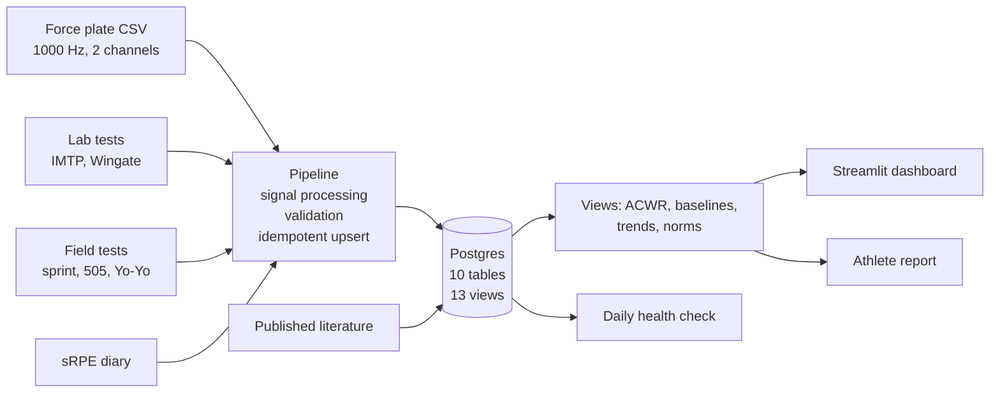

# Athlete Performance Platform

Athlete monitoring dashboard for a sport institute. Force plate traces and field
test exports go into Postgres, and a coach opens one page to see who to look at
today.

The data is synthetic; see Limitations.

**[Live dashboard](https://athlete-performance-platform-t7srsbtt93rd2j4ctrm5m4.streamlit.app)**


## Scope

16 athletes, 4 sports, 180 days. 1255 test sessions, 13k measurements.

Tests: CMJ and IMTP on a force plate, Wingate on a cycle ergometer, sprint and
505 through timing gates, Yo-Yo IR1, anthropometry, and pool time trials for the
swimmers. Which battery an athlete does depends on their sport — a Yo-Yo IR1 is
not useful for a swimmer.

Analytics: ACWR (EWMA 7:28), individual 28-day CMJ baselines, fitted trends per
physical quality, comparison against published normative data.

## Setup

```bash
git clone https://github.com/Bolu-V50/athlete-performance-platform
cd athlete-performance-platform
python -m venv .venv && source .venv/bin/activate
pip install -r requirements-dev.txt

cp .env.example .env          # Postgres URL required, Groq key optional
python -m src.db.apply_schema
python -m src.db.apply_views
python scripts/generate_synthetic_data.py
python -m src.ingest.pipeline
streamlit run app/streamlit_app.py
```

The 716 raw traces are ~40 MB and not committed. The generator is seeded and
reproduces them exactly. The latest trial per athlete is committed so the
force-time panel works without regenerating.

```
src/signal_processing/   waveform to CMJ metrics
src/ingest/              pipeline
src/db/                  schema, catalogue, views
src/analytics/           queries, briefing, report
src/ops/                 health check
app/streamlit_app.py
scripts/                 generator, screenshots
tests/
```

## Architecture



## Signal processing


Jump height uses impulse-momentum. Flight time is reported alongside it as a
cross-check; the two diverge when landing posture differs from take-off.

Onset detection anchors on the deepest unweighting point. Searching backwards
from take-off looks reasonable and isn't: force crosses back through body weight
between the unweighting and braking phases, the search stops there, and the
truncated impulse inflates the result. First version read 62 cm for a 36 cm jump.

Threshold crossings are detected on the raw trace. Zero-lag filtering smears the
landing spike about 30 ms into the flight phase, which shortens measured flight
time. Integration still uses the filtered signal.

Recovery against synthetic traces with known ground truth: within 0.7 mm across
55-95 kg, 8-65 cm, 500-2000 Hz.

## Database notes

Metrics are stored long, one row per measurement. Adding the six non-force-plate
batteries needed no schema change.

`metric_catalog` carries unit, physical quality and polarity for each of the 34
metrics. 8 of them improve by getting smaller (sprint times, 505, fatigue index,
skinfolds), so trends and z-scores have to know the direction. 4 carry NULL
polarity — a braking duration has no better direction, and the views return NULL
rather than pick one.

Trends come from `regr_slope` over every test, with `regr_r2` surfaced next to
them. First-versus-latest inherits the test-retest error of two single days: one
athlete's jump height reads +7.3% by endpoints and -2.1% by fit over the same 44
tests.

Change is compared against the athlete's own CV. 4% means something at CV 1.2%
and nothing at CV 9%.

Writes are `ON CONFLICT ... DO UPDATE` against real unique constraints. Row
counts don't move on a re-run.

Validation thresholds are physiological: CMJ 5-120 cm, sRPE 0-10, positive
duration. Rejected rows go to `data_quality_log` with the rule that caught them.

## LLM layer

The dashboard writes a daily squad briefing and a per-athlete development report.
Numbers all come from SQL. The model gets a closed block of pre-computed facts
and picks which to mention.

Four checks on every generation:

| Check | Catches |
|---|---|
| Numeric guard | Figures that don't trace to the facts, matched at the precision written |
| Directional contradiction | "rose from 0.360 to 0.324" |
| Gendered pronouns | The facts carry no sex; it called a woman in the football squad "his" |
| Prescription language | Sets, sessions, deloads |

Two judgements got moved into SQL after the model got both wrong in one
paragraph: whether a change clears the athlete's repeat variation, and which way
a raw value moved. It called a -7.0% trend against 5.8% variation "within noise",
and described a skinfold sum falling from 60.2 to 52.9 mm as rising.

A rejected section retries once, then falls back to a template. Works with no API
key.

## Normative comparison

Four papers, stored with DOI or PMID and the date each was verified:

- Seraphin et al. 2025, professional women's soccer, n=28. IMTP relative force,
  CMJ height. [10.25035/jsmahs.10.03.01](https://doi.org/10.25035/jsmahs.10.03.01)
- Krustrup et al. 2005, elite female soccer, n=14. Yo-Yo IR1.
  [PMID 16015145](https://pubmed.ncbi.nlm.nih.gov/16015145/)
- Suárez-Balsera et al. 2025, professional male basketball, n=39. CMJ height.
  [10.5114/jhk/196138](https://doi.org/10.5114/jhk/196138)
- Dos'Santos et al. 2018, team-sport athletes, both sexes. 505 and 10 m sprint.
  [10.3390/sports6040174](https://doi.org/10.3390/sports6040174)

Matched on sport and sex. A z-score is only computed where the paper published an
SD. A 95% CI describes uncertainty about the mean, which is a much narrower band
and would put an athlete several SD out when they're a fraction of one. Where
nothing matches, the panel is empty and says so. Swimming and athletics aren't
covered.

Bangsbo et al. 2008 was read and left out: nearly all its group values are only
in bar charts. Recorded in `src/db/normative.sql`.

## CI and monitoring

`ci.yml` on every push: applies schema, catalogue and views to the database,
regenerates the dataset, runs the tests, runs the health check.

`data-health.yml` daily: 11 invariants against the data, non-zero exit on any
break. On its first run it found 11 metrics the pipeline was storing that had no
catalogue entry, so every view was dropping them.

`ingest.yml` manual. The dataset is static and its raw files aren't in the repo,
so a scheduled run would just re-read the same files. The job runs the pipeline
unattended with credentials from a secret store and asserts idempotency by
running it twice.

Out-of-range stored values are reported as a diagnostic. Tightening a catalogue
range would otherwise turn every historical row into an alert.

## Limitations

Synthetic data. Real athlete data is identifiable health information. Traces come
from a physical model where peak force is solved so net impulse equals
`m·√(2gh)`, so the analyser has to actually process them to get the right answer.

One device type per test. A real service reconciles several, and manufacturers
don't agree on how to compute RSI-mod. Nothing here is comparable across systems,
which is why comparisons are against the athlete's own history.

No accounts or access control. A real AMS needs role-based access.

The 28-day rolling baseline adapts to sustained change, so a slow decline partly
hides itself. The flag catches acute deviation.

The -1.5 SD flag fires by chance at roughly 7% per test. Two of the current flags
are exactly that. No multiplicity correction.

ACWR's 0.80-1.30 band is contested, including on mathematical coupling between
numerator and denominator. Presented as a prompt, and a neuromuscular flag
outranks it in the queue.

sRPE is self-reported and not comparable between athletes.

The force-time panel analyses the raw file live. If that file changed after
ingest the stored metrics are stale, and there's no content hash to catch it.

Normative coverage is four papers and two sports.

## Stack

Python 3.12+, PostgreSQL 17 (Supabase), SQLAlchemy 2, psycopg 3, NumPy, SciPy,
pandas, Streamlit, Altair, matplotlib, pytest, GitHub Actions. Groq for the LLM
layer, optional.
